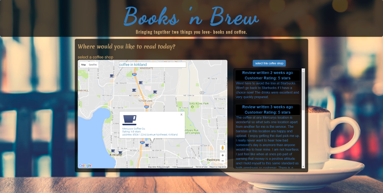

# Books n Brew
#### Bringing together two things you love- books and coffee.

### TOC
1. [User Guide w/ Screenshots](#user)
2. [Summary](#summary)
3. [Key technologies used](#key)

### User Guide
##### On the landing page click the button to get started.

##### On the next page, search for an e-book.

##### On the third page, search for a nearby cafe to read at.

##### On the fourth and final page, you will find an external link to the book you selected and directions to the cafe you chose.

### Summary
The purpose of the Books n Brew app is to connect someone with an e-book and a coffee shop. Maybe someone ends up in a new city with some spare time. They could search for a book and then find the nearest coffee shop to read at. The app can provide driving and walking directions to the coffee shop they find.

### Key Technologies Used
- HTML
- CSS
- JavaScript
- jQuery
- Bootstrap
- Google Books API
- Google Maps and Directions APIs